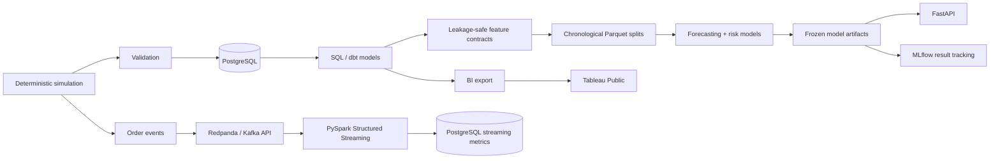

# FulfillAI

**A supply-chain data and machine-learning system built around one idea: predictions are only useful when the data path behind them is trustworthy.**

I started FulfillAI because I wanted to work through the parts of an ML system that usually get skipped in small projects. Instead of beginning with a clean dataset, I began with the operational side: customers, products, warehouses, inventory, orders, shipments, and events. From there I built the path into PostgreSQL, analytical models, leakage-safe feature sets, forecasting and risk models, streaming, serving, and a small BI layer.

The project grew in stages, and I kept the mistakes that taught me something. The clearest example is Delivery V1: the first synthetic benchmark was technically valid but barely learnable. Rather than hiding the weak result, I kept it, traced the problem back to the data-generating process, versioned the benchmark, and rebuilt the experiment as Delivery V2.

## What is here

FulfillAI currently includes:

- deterministic synthetic fulfillment data generation;
- relational and temporal data-quality checks;
- PostgreSQL operational modeling and analytical SQL;
- dbt staging and mart models with tests;
- chronological feature materialization to Parquet;
- demand forecasting for intermittent / zero-inflated demand;
- late-delivery, delivery-exception, stockout, and reorder-breach models;
- explicit leakage contracts and one-time final-test guards;
- FastAPI endpoints around frozen model artifacts;
- MLflow logging for frozen experiment results;
- Redpanda/Kafka-compatible events with PySpark Structured Streaming;
- a PostgreSQL streaming sink with restart/checkpoint validation;
- Docker Compose environments for the platform pieces;
- GitHub Actions for source checks and container builds;
- a published Tableau Public operations dashboard;
- Azure Container Apps infrastructure-as-code as an undeployed extension.

## Architecture



The deeper component view is in [`docs/architecture.md`](docs/architecture.md).

## The part I care about most: evaluation discipline

The modeling workflow is chronological rather than randomly split:

```text
TRAIN       2025-08-01 → 2026-04-30
VALIDATION  2026-05-01 → 2026-05-31
TEST        2026-06-01 → 2026-07-31
```

Validation is where architecture and threshold decisions are made. Test is treated as a final estimate after those decisions are frozen.

```text
TRAIN
  ↓ fit candidate models
VALIDATION
  ↓ choose architecture / threshold
freeze decisions
  ↓
TRAIN + VALIDATION
  ↓ final refit
clean source state
  ↓
TEST once
  ↓
record final metrics
```

The binary evaluator refuses final-test access when the working tree is dirty and refuses a second evaluation once the final-test artifact exists. The demand pipeline uses equivalent freeze checks. These guards are intentionally stricter than a typical local experiment because I wanted the repository to make leakage and test reuse difficult by construction, not just by convention.

See [`docs/ml_methodology.md`](docs/ml_methodology.md) for the full reasoning.

## Final model results

These are the frozen final-test results from the completed experiments. Large model/data artifacts are not stored in Git; the durable record is in [`docs/results.md`](docs/results.md).

| Task | Final model / architecture | Primary final-test result | Comparison |
|---|---|---:|---|
| Daily demand forecasting | Hard-gated hurdle: occurrence classifier + magnitude regressor | **69.588% WAPE** | 21.14% relative WAPE improvement vs rolling-28 baseline |
| Late-delivery risk, V2 | Balanced logistic regression | **0.303115 PR-AUC** | 3.28× test prevalence baseline |
| Delivery-exception risk, V2 | Balanced logistic regression | **0.167229 PR-AUC** | 4.13× test prevalence baseline |
| 7-day stockout risk | Random forest | **0.359567 PR-AUC** | ROC-AUC 0.992886; recall 0.832911 |
| 7-day reorder-breach risk | Random forest | **0.998317 PR-AUC** | F1 0.975801 |

The reorder result is unusually high because the data is synthetic and the future label is strongly determined by prior inventory state. I keep that caveat next to the result rather than treating it as evidence of real-world accuracy.

## A useful failure: Delivery V1 → V2

Delivery V1 taught me more than a successful benchmark would have. Its final PR-AUC was close to prevalence even after legitimate modeling changes. The issue was upstream: late/exception outcomes in the simulation were almost independent of the features that would actually be available at prediction time.

I kept V1 as part of the project history. Delivery V2 changes the synthetic data-generating process so risk depends on shipment-time-safe variables such as carrier, service level, warehouse pressure, and calendar effects. Then the entire validation → freeze → final-test process is run again as a new benchmark version.

That distinction matters to me because changing a simulation after seeing a weak test result is not the same thing as improving a model. The repository documents the change as a benchmark redesign, not a hidden tuning step.

## Demand forecasting

Demand is sparse enough that a single regressor tends to spend most of its effort near zero. The final approach separates two questions:

1. will demand be positive?
2. if it is positive, how large will it be?

The frozen prediction is hard-gated:

```text
P(demand > 0)
      ↓
threshold = 0.925
   ↙       ↘
below     above
  ↓         ↓
  0     magnitude model
```

This is not a probability-weighted expectation. The magnitude forecast is emitted only when the occurrence probability crosses the frozen threshold.

## Delivery and inventory risk

Delivery uses two separate shipment-level questions:

- `is_late_delivery` for delivered shipments;
- `is_delivery_exception` for eligible dispatched shipments.

Post-outcome fields such as `delivered_at`, final shipment status, and actual transit time are excluded from predictors.

Inventory models operate at `date × warehouse × product` grain and predict:

- stockout in the next 7 days;
- reorder-threshold breach in the next 7 days.

The feature contract uses prior-day inventory state and historical demand while reserving future windows for label construction only.

## Platform layer

The original project was batch-first. I later added a platform layer around the frozen model artifacts without changing their historical test results.

### Analytics engineering

`dbt/` contains PostgreSQL sources, staging models, a fulfillment fact mart, a warehouse-day mart, and schema tests. The local build has been exercised against FulfillAI PostgreSQL.

### API and experiment tracking

`src/fulfillai/api/` exposes health, frozen-result, model-discovery, and artifact-backed prediction endpoints. `src/fulfillai/mlops/` records the already-frozen benchmark results in MLflow without retraining them.

### Streaming

The streaming path is deliberately small enough to understand end to end:

```text
order events
   ↓
Redpanda
   ↓
PySpark Structured Streaming
   ↓
watermark + windowed aggregates
   ↓
checkpointed output
   ↓
PostgreSQL sink
```

The verification scripts run the stream across multiple rounds with the same checkpoint so restart/resume behavior is part of the test, not an assumption.

### Cloud

`infra/azure/` contains a Bicep template for Azure Container Apps. It is included as infrastructure work, but I do not describe the Azure path as deployed because I have not treated an unverified template as a deployment.

## Tableau dashboard

I added a simple dashboard after the analytical layer was stable because I wanted the same data to be useful outside the modeling code.

[**Open FulfillAI — Supply Chain Intelligence on Tableau Public**](https://public.tableau.com/app/profile/chaithanya.vemuri/viz/FullfillAI_Supplychain_Intelligence/FulfillAI-ExecutiveOverview)


The dashboard uses the generated `warehouse_daily.csv` BI export rather than a live PostgreSQL connection. It includes total orders, delivered shipments, late-delivery and exception rates, warehouse comparisons, daily order volume, and warehouse cross-filtering.

Implementation notes are in [`docs/tableau_dashboard.md`](docs/tableau_dashboard.md).

## Data model

The default simulation covers **2025-08-01 through 2026-07-31** and creates:

- 5,000 customers;
- 300 products across 12 categories;
- 5 warehouses across the US, Germany, UK, and Canada;
- 50,000 orders;
- shipments, order events, and inventory movements;
- seasonality, weekends, holidays, cancellations, carrier behavior, shipping services, and inventory dynamics.

The PostgreSQL core has 10 operational tables:

`customers`, `product_categories`, `products`, `warehouses`, `inventory`, `orders`, `order_items`, `shipments`, `inventory_movements`, and `order_events`.

The event and relational semantics are documented in [`docs/event_model.md`](docs/event_model.md) and [`docs/data_model.md`](docs/data_model.md).

## Repository layout

```text
fulfillai/
├── configs/                 # deterministic simulation settings
├── data/                    # generated locally; ignored by Git
├── dbt/                     # analytics engineering models and tests
├── docker/                  # API, MLflow, and Spark images
├── docs/                    # architecture, methodology, results, build notes
├── infra/azure/             # Azure Container Apps Bicep template
├── scripts/                 # verification, streaming, and guarded test helpers
├── sql/
│   ├── schema/              # PostgreSQL operational schema
│   ├── models/              # analytical / ML feature views
│   └── analytics/           # business analysis queries
├── src/fulfillai/
│   ├── api/                 # frozen-artifact API
│   ├── data/                # generation, validation, PostgreSQL load
│   ├── features/            # extraction, contracts, chronological materialization
│   ├── ml/                  # demand, delivery, and inventory experiments
│   ├── mlops/               # MLflow result logging
│   └── streaming/           # event producer and Spark pipeline
├── tests/                   # source and platform contract tests
├── compose.yaml
├── compose.streaming.yaml
└── Makefile
```

## Run the batch path locally

### 1. Environment

```bash
python3.11 -m venv .venv
source .venv/bin/activate
pip install -r requirements.txt
cp .env.example .env
```

Add your local PostgreSQL password to `.env`.

### 2. PostgreSQL

```bash
docker compose up -d postgres
```

### 3. Generate and validate data

```bash
python -m src.fulfillai.data.generator
python -m src.fulfillai.data.validation
```

### 4. Load PostgreSQL

```bash
python -m src.fulfillai.data.load
python -m src.fulfillai.data.load --load --replace
```

### 5. Build SQL models

```bash
make sql-models
```

### 6. Materialize ML datasets

```bash
python -m src.fulfillai.features.validate
python -m src.fulfillai.features.build_features
```

Chronological Parquet splits and metadata are written under `data/processed/features/`.

### 7. Verify source contracts

```bash
make verify
```

`make verify` checks imports, configuration contracts, duplicate YAML keys, required files, and Python syntax. It does not train models or open generated test partitions.

## Reproducing modeling experiments

The repository keeps experiment lineage on purpose, especially in the demand folder. Earlier baselines and intermediate approaches are still present because they explain how the final architecture was reached.

Before rerunning completed experiments, read [`docs/repository_guide.md`](docs/repository_guide.md). The important boundary is simple: use validation to make decisions; do not use the frozen test set as another tuning loop.

## Notes from building it

[`docs/build_notes.md`](docs/build_notes.md) records the decisions, mistakes, and parts of the system I found most interesting while building FulfillAI. It is intentionally more personal than the architecture and methodology docs.

[`docs/roadmap.md`](docs/roadmap.md) contains ideas I still want to explore rather than a list of technologies to collect.

## Technology

Python 3.11 · PostgreSQL 17 · SQL · dbt · Pandas · NumPy · scikit-learn · PyArrow · Psycopg · FastAPI · MLflow · Docker Compose · Redpanda · PySpark Structured Streaming · Tableau · GitHub Actions · Bicep

---

FulfillAI is synthetic by design. The point of the project is not to claim production business accuracy; it is to understand the full data-to-decision path, make the assumptions visible, and keep the evaluation honest when the project changes.
