# FulfillAI

**Leakage-safe e-commerce operations intelligence and machine-learning platform**

FulfillAI is a portfolio-scale Data + ML system that simulates an e-commerce fulfillment network, validates and loads the data into PostgreSQL, builds analytical SQL views, materializes chronological machine-learning datasets, and evaluates forecasting and risk models under a strict train → validation → frozen-test protocol.

The core data and ML pipeline is complete. The repository currently contains synthetic data generation, data-quality checks, PostgreSQL modeling, SQL analytics, feature engineering, demand forecasting, delivery-risk modeling, inventory-risk modeling, and reproducibility safeguards. API serving, streaming, BI dashboards, and deployment are documented as future extensions rather than presented as finished work.

## Why this project is technically interesting

FulfillAI is not just a collection of notebooks. The project focuses on problems that appear in real ML systems:

- **time-aware evaluation** instead of random train/test splitting;
- **feature leakage prevention** through explicit contracts and SQL cutoffs;
- **imbalanced classification** evaluated primarily with PR-AUC;
- **intermittent / zero-inflated demand** handled with a hurdle architecture;
- **model freeze discipline** before final test evaluation;
- **one-time test guards** that prevent repeated test-set tuning;
- **reproducible synthetic data generation** with deterministic seeds;
- **database-to-Parquet ML feature pipelines** with metadata and row-contract checks;
- **scientific redesign of an unlearnable synthetic benchmark** for Delivery V2.

## Final model results

The following values are from the completed frozen test runs. Generated model and metric artifacts are intentionally excluded from Git, so the durable project summary is documented in [`docs/results.md`](docs/results.md).

| Task | Final model / architecture | Primary final-test result | Key comparison |
|---|---|---:|---|
| Daily demand forecasting | Hurdle: occurrence classifier + magnitude regressor | **69.588% WAPE** | 21.14% relative WAPE improvement vs rolling-28 baseline |
| Late-delivery risk, V2 | Balanced logistic regression | **0.303115 PR-AUC** | 3.28× test prevalence baseline |
| Delivery-exception risk, V2 | Balanced logistic regression | **0.167229 PR-AUC** | 4.13× test prevalence baseline |
| 7-day stockout risk | Random forest | **0.359567 PR-AUC** | ROC-AUC 0.992886; recall 0.832911 |
| 7-day reorder-breach risk | Random forest | **0.998317 PR-AUC** | F1 0.975801 |

Delivery V1 is preserved as the original benchmark. Its weak final results exposed a data-generation flaw: the synthetic delivery labels were nearly independent of prediction-time-safe features. Delivery V2 corrected the simulation so risk is generated from shipment-time variables, then repeated the full validation → freeze → one-time-test process. This is documented as a **data-generating-process correction**, not as ordinary post-test model tuning.

## System architecture

```mermaid
flowchart LR
    A[Deterministic synthetic generator] --> B[CSV datasets]
    B --> C[Data-quality validation]
    C --> D[(PostgreSQL 17)]
    D --> E[Analytical SQL models / views]
    D --> F[Business analytics SQL]
    E --> G[Leakage-safe feature contracts]
    G --> H[Chronological Parquet splits]
    H --> I[TRAIN]
    H --> J[VALIDATION]
    H --> K[TEST locked]
    I --> L[Model candidates]
    J --> L
    L --> M[Freeze architecture + threshold]
    M --> N[Final refit on TRAIN + VALIDATION]
    N --> O[Commit / clean-tree gate]
    O --> K
    K --> P[One-time final test]
    P --> Q[Immutable final metrics]
```



See [`docs/architecture.md`](docs/architecture.md) for the detailed component view and [`docs/ml_methodology.md`](docs/ml_methodology.md) for the evaluation protocol.

## Data platform

The default synthetic simulation covers **2025-08-01 through 2026-07-31** and is configured for:

- 5,000 customers
- 300 products across 12 categories
- 5 fulfillment warehouses in the US, Germany, UK, and Canada
- 50,000 orders
- shipments, order events, and inventory movements
- seasonality, weekends, holidays, cancellations, carrier behavior, shipping services, and inventory dynamics

The PostgreSQL schema contains 10 core operational tables:

`customers`, `product_categories`, `products`, `warehouses`, `inventory`, `orders`, `order_items`, `shipments`, `inventory_movements`, and `order_events`.

Six analytical SQL queries cover executive KPIs, warehouse performance, product demand, inventory risk, order lifecycle, and carrier performance. Five SQL model files create the analytical feature layers used downstream.

## ML tasks

### 1. Demand forecasting

**Target:** `units_sold` per `demand_date × warehouse × product`.

The demand pipeline progresses from naive/rolling baselines through Poisson and HistGradientBoosting experiments, leakage discovery, stronger historical features, temporal robustness checks, and finally a **hurdle model** for zero-inflated demand:

```text
P(demand > 0)
      ×
E(units | demand > 0)
      ↓
expected daily units
```

The final hurdle threshold was frozen before the one-time test.

### 2. Delivery risk

Two binary tasks use one row per shipment:

- `is_late_delivery` — evaluated only for delivered shipments;
- `is_delivery_exception` — evaluated for all eligible dispatched shipments.

Delivery V2 makes synthetic risk depend on information available by shipment time, including carrier, shipping method, warehouse, processing pressure, and calendar effects. Outcome fields such as `delivered_at`, final `shipment_status`, `actual_transit_hours`, and `delivery_delay_hours` are prohibited as predictors.

### 3. Inventory risk

Two 7-day horizon classifiers operate at `demand_date × warehouse × product` grain:

- `target_stockout_next_7d`
- `target_reorder_breach_next_7d`

Prediction-time features use prior-day inventory state and historical demand. Future inventory windows exist only for label construction and are explicitly excluded from the feature matrix.

## Evaluation discipline

The core split is chronological:

```text
TRAIN       2025-08-01 → 2026-04-30
VALIDATION  2026-05-01 → 2026-05-31
TEST        2026-06-01 → 2026-07-31
```

The workflow is deliberately strict:

```text
TRAIN
  ↓ fit candidate models
VALIDATION
  ↓ choose architecture / threshold
freeze decisions
  ↓
TRAIN + VALIDATION
  ↓ final refit
clean Git commit
  ↓
TEST exactly once
  ↓
no post-test model changes
```

The binary workflow refuses final test evaluation when the Git working tree is dirty and refuses to re-evaluate if the one-time test artifact already exists. The demand evaluator applies equivalent freeze checks.

## Repository layout

```text
fulfillai/
├── configs/                 # deterministic simulation configuration
├── data/                    # generated data; contents ignored by Git
├── docs/                    # architecture, methodology, results, portfolio notes
├── scripts/                 # verification and guarded final-test helpers
├── sql/
│   ├── schema/              # PostgreSQL operational schema
│   ├── models/              # analytical / ML feature views
│   └── analytics/           # business analysis queries
├── src/fulfillai/
│   ├── data/                # generation, validation, atomic PostgreSQL load
│   ├── features/            # extraction, validation, splitting, Parquet materialization
│   └── ml/                  # demand, delivery, inventory workflows
├── tests/                   # source-level contract tests
├── compose.yaml
├── Makefile
└── requirements*.txt
```

## Quick start

### 1. Create the environment

```bash
python3.11 -m venv .venv
source .venv/bin/activate
pip install -r requirements.txt
cp .env.example .env
```

Edit `.env` with your local PostgreSQL password.

### 2. Start PostgreSQL

```bash
docker compose up -d postgres
```

### 3. Generate and validate the synthetic operational data

```bash
python -m src.fulfillai.data.generator
python -m src.fulfillai.data.validation
```

### 4. Load PostgreSQL atomically

First run the preflight:

```bash
python -m src.fulfillai.data.load
```

Then perform the load:

```bash
python -m src.fulfillai.data.load --load --replace
```

### 5. Create the analytical SQL views

The included Makefile can apply all model SQL files in order:

```bash
make sql-models
```

### 6. Materialize leakage-safe ML datasets

```bash
python -m src.fulfillai.features.validate
python -m src.fulfillai.features.build_features
```

This writes chronological Parquet splits and reproducibility metadata under `data/processed/features/`.

### 7. Run source-level verification

```bash
make verify
```

`make verify` does not open generated Parquet test partitions or train models. It checks imports, configuration contracts, duplicate YAML keys, required files, and Python syntax.

## Reproducing modeling experiments

The modeling source is intentionally kept separate from generated model artifacts. Read [`docs/repository_guide.md`](docs/repository_guide.md) before re-running experiments, especially the rules around final test partitions.

The most important rule is simple: **validation is for decisions; test is for one final estimate.** Do not use final test results to retune the corresponding frozen experiment.

## Portfolio / interview material

Recruiter summary, resume bullets, LinkedIn wording, and technical interview talking points are in [`docs/portfolio.md`](docs/portfolio.md).

## Current scope and future extensions

**Implemented:** synthetic data platform, PostgreSQL, analytics SQL, feature engineering, chronological dataset materialization, demand forecasting, delivery-risk modeling, inventory-risk modeling, test-lock safeguards, and final evaluation.

**Not yet implemented:** production API, real-time event broker, BI dashboard application, cloud deployment, model monitoring, and CI/CD. These are natural next steps and are listed in [`docs/roadmap.md`](docs/roadmap.md).

## Technology

Python 3.11 · PostgreSQL 17 · Docker Compose · Pandas · NumPy · scikit-learn · PyArrow · Psycopg · SQL · Joblib

---

FulfillAI is designed as an explainable portfolio project: every major model result is tied to a data contract, a temporal split, a validation decision, and a frozen final test.
