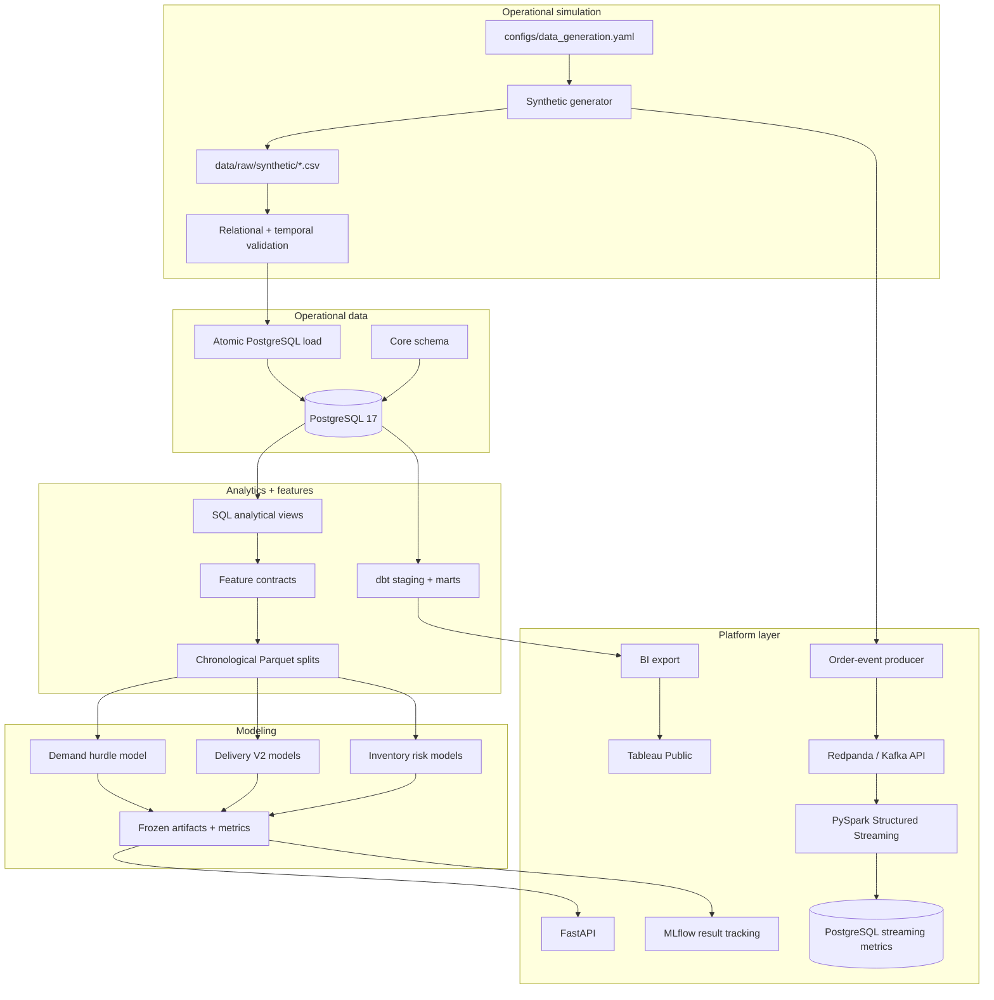
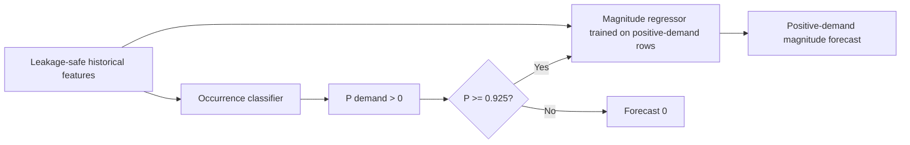
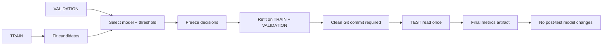
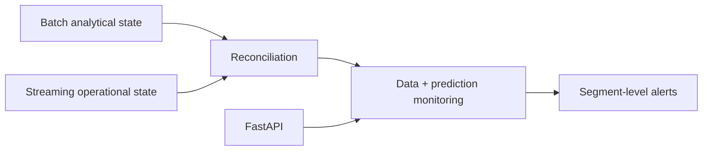

# FulfillAI Architecture

FulfillAI has two connected paths: a batch data/ML workflow and a small platform workflow around the frozen artifacts. The batch path owns data generation, validation, feature construction, and model evaluation. The platform path adds dbt, serving, experiment tracking, streaming, and BI without reopening the historical final tests.

## 1. Current end-to-end architecture



The two paths share the same domain and source assumptions, but they have different responsibilities. The platform layer is allowed to consume frozen artifacts; it is not allowed to turn an already-used test partition back into a tuning surface.

## 2. Operational data model

The relational layer contains 10 core tables:

- `customers`
- `product_categories`
- `products`
- `warehouses`
- `inventory`
- `orders`
- `order_items`
- `shipments`
- `inventory_movements`
- `order_events`

`inventory_movements` and `order_events` preserve an auditable operational history instead of relying only on current-state tables.

See [`data_model.md`](data_model.md) and [`event_model.md`](event_model.md).

## 3. Analytical SQL layer

The repository has two SQL layers.

### Model / feature views

| File | Purpose |
|---|---|
| `001_order_facts.sql` | order-level analytical facts |
| `002_daily_product_demand.sql` | daily warehouse/product demand with historical signals |
| `003_warehouse_product_daily.sql` | warehouse/product daily operational state |
| `004_delivery_features.sql` | shipment-time delivery prediction features and outcome labels |
| `005_inventory_risk_features.sql` | prior-state inventory features and future-window labels |

### Business analytics

`sql/analytics/` includes executive KPIs, warehouse performance, product demand, inventory risk, order lifecycle, and carrier performance queries.

## 4. Feature-contract boundary

`src/fulfillai/features/config.py` is the contract between SQL and ML. Each dataset defines:

- source view;
- output directory;
- chronological split column;
- target columns;
- primary key / grain;
- required fields;
- fields prohibited from model input;
- optional population eligibility;
- task description.

The feature pipeline validates the SQL source before it creates any Parquet artifacts. This prevents model code from silently deciding what is or is not leakage-safe.

## 5. Chronological data flow

The default simulation window is one year:

```text
2025-08-01 ------------------------------------------------ 2026-07-31

TRAIN                     VALIDATION          TEST
2025-08-01..2026-04-30    2026-05-01..05-31  2026-06-01..07-31
```

Random train/test splitting is deliberately avoided for all time-dependent tasks.

## 6. ML architecture

### Demand

Demand is heavily zero-inflated. The final architecture is a hurdle model:



The frozen Phase 8 implementation is **hard-gated**, not probability-weighted: the magnitude prediction is emitted only when occurrence probability meets the frozen threshold.

### Delivery

Delivery has two related but distinct classifiers:

```text
Dispatched shipment
      |
      +--> Delivery exception model: P(exception)
      |
      +--> Late delivery model: P(late | delivered)
```

The late-delivery task uses `is_delivered` as an eligibility filter; exception rows are not mislabeled as ordinary on-time deliveries.

### Inventory

Inventory models use the same leakage-safe binary workflow for:

- stockout in the next 7 days;
- reorder-threshold breach in the next 7 days.

Predictors are restricted to information available before the forecast horizon, including prior-day inventory and historical demand.

## 7. Freeze and one-time-test architecture

The final evaluation design is a first-class part of the system rather than an informal convention.



For the shared binary workflow, the evaluator checks that the working tree is clean and refuses a second test evaluation when the final test artifact already exists. The demand final evaluator implements equivalent checks for its frozen hurdle bundle.

## 8. Artifact policy

Generated datasets and ML artifacts are intentionally not committed:

```text
data/raw/synthetic/*
data/processed/features/*
artifacts/*
models/*
```

This keeps the public repository lightweight and avoids accidentally publishing large Parquet or Joblib files. Reproducibility comes from source code, deterministic configuration, metadata contracts, and documented final results.

## 9. Platform boundaries and open extensions

The platform additions are intentionally narrower than a production commerce system. The repository currently contains working local paths for dbt, API serving, MLflow, Redpanda/PySpark streaming, PostgreSQL reconciliation, Docker, and Tableau. Azure Container Apps is represented by Bicep but has not been treated as a completed deployment.

The next architectural questions I am interested in are monitoring, online/offline feature consistency, and tighter reconciliation between batch and streaming outputs:



Those are intentionally left as open work rather than drawn as finished components.
