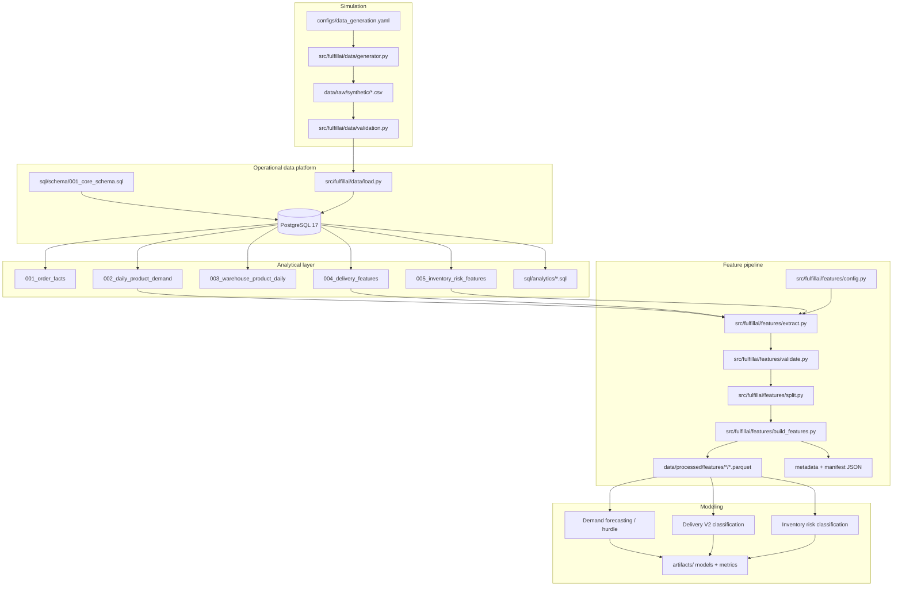
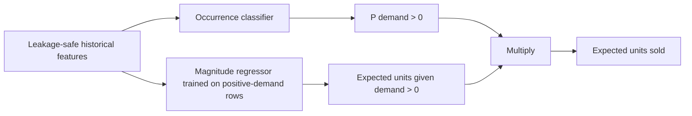
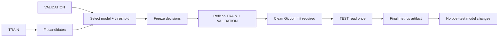
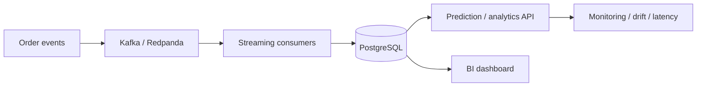

# FulfillAI Architecture

FulfillAI is an end-to-end e-commerce operations intelligence and machine-learning system. The current repository implements the batch data and ML path. Streaming, serving, dashboards, and cloud deployment remain optional extensions.

## 1. Current end-to-end architecture



## 2. Operational data model

The relational layer contains 10 core tables:

- `customers`
- `product_categories`
- `products`
- `warehouses`
- `inventory`
- `orders`
- `order_items`
- `shipments`
- `inventory_movements`
- `order_events`

`inventory_movements` and `order_events` preserve an auditable operational history instead of relying only on current-state tables.

See [`data_model.md`](data_model.md) and [`event_model.md`](event_model.md).

## 3. Analytical SQL layer

The repository has two SQL layers.

### Model / feature views

| File | Purpose |
|---|---|
| `001_order_facts.sql` | order-level analytical facts |
| `002_daily_product_demand.sql` | daily warehouse/product demand with historical signals |
| `003_warehouse_product_daily.sql` | warehouse/product daily operational state |
| `004_delivery_features.sql` | shipment-time delivery prediction features and outcome labels |
| `005_inventory_risk_features.sql` | prior-state inventory features and future-window labels |

### Business analytics

`sql/analytics/` includes executive KPIs, warehouse performance, product demand, inventory risk, order lifecycle, and carrier performance queries.

## 4. Feature-contract boundary

`src/fulfillai/features/config.py` is the contract between SQL and ML. Each dataset defines:

- source view;
- output directory;
- chronological split column;
- target columns;
- primary key / grain;
- required fields;
- fields prohibited from model input;
- optional population eligibility;
- task description.

The feature pipeline validates the SQL source before it creates any Parquet artifacts. This prevents model code from silently deciding what is or is not leakage-safe.

## 5. Chronological data flow

The default simulation window is one year:

```text
2025-08-01 ------------------------------------------------ 2026-07-31

TRAIN                     VALIDATION          TEST
2025-08-01..2026-04-30    2026-05-01..05-31  2026-06-01..07-31
```

Random train/test splitting is deliberately avoided for all time-dependent tasks.

## 6. ML architecture

### Demand

Demand is heavily zero-inflated. The final architecture is a hurdle model:



### Delivery

Delivery has two related but distinct classifiers:

```text
Dispatched shipment
      |
      +--> Delivery exception model: P(exception)
      |
      +--> Late delivery model: P(late | delivered)
```

The late-delivery task uses `is_delivered` as an eligibility filter; exception rows are not mislabeled as ordinary on-time deliveries.

### Inventory

Inventory models use the same leakage-safe binary workflow for:

- stockout in the next 7 days;
- reorder-threshold breach in the next 7 days.

Predictors are restricted to information available before the forecast horizon, including prior-day inventory and historical demand.

## 7. Freeze and one-time-test architecture

The final evaluation design is a first-class part of the system rather than an informal convention.



For the shared binary workflow, the evaluator checks that the working tree is clean and refuses a second test evaluation when the final test artifact already exists. The demand final evaluator implements equivalent checks for its frozen hurdle bundle.

## 8. Artifact policy

Generated datasets and ML artifacts are intentionally not committed:

```text
data/raw/synthetic/*
data/processed/features/*
artifacts/*
models/*
```

This keeps the public repository lightweight and avoids accidentally publishing large Parquet or Joblib files. Reproducibility comes from source code, deterministic configuration, metadata contracts, and documented final results.

## 9. Future architecture extensions

The repository contains placeholder packages for API/analytics/streaming, but these are not presented as implemented features. Natural next components are:



These are optional extensions after the completed data + ML core.
