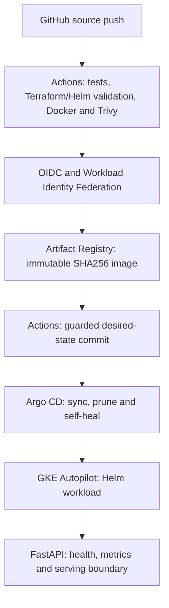
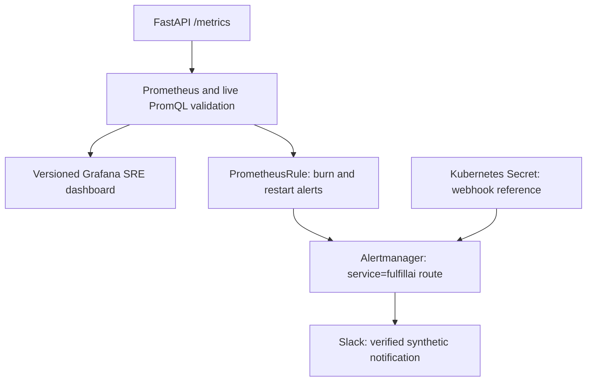

# FulfillAI Platform Engineering V2 - verified overview

FulfillAI combines a synthetic e-commerce data/ML platform with a completed, controlled production-style platform lab around its FastAPI service. The ML work remains central: PostgreSQL/dbt, forecasting and risk models, Redpanda/PySpark streaming, MLflow and frozen chronological evaluation.

## Start with the evidence

- **Implementation branch:** [`platform-engineering-v2`](https://github.com/nikchey29/fulfillai/tree/platform-engineering-v2). V2 is not merged into `main`; the default branch links to the completed implementation.
- **Verified closure snapshot:** [`d8362db`](https://github.com/nikchey29/fulfillai/commit/d8362dbafd87d703f0f8358a792f55b7d7a07dd6). Subsequent presentation commits do not alter runtime or infrastructure files.
- **Successful delivery run:** [GitHub Actions 37233814366](https://github.com/nikchey29/fulfillai/actions/runs/37233814366), source `cc76e72341430186d9f946bc206af788f5a5a1ae`; all six jobs completed successfully, including keyless GCP authentication, publishing and GitOps rollout verification.
- **Promoted image digest:** `sha256:673ae4e0934ba051e9d8b090da631742f2de1867ef19f5218def50a19a1add69`, recorded in [the closure values file](https://github.com/nikchey29/fulfillai/blob/d8362dbafd87d703f0f8358a792f55b7d7a07dd6/deploy/helm/fulfillai/values-gitops.yaml).

This page consolidates the recorded closure, public source and successful CI evidence. It is not a claim that the environment was re-provisioned or all drills were re-run during this documentation refresh. Source definitions prove implementation; runtime assertions below refer to completed verification exercises.

## Data and ML results

- Deterministic synthetic benchmark: **50K orders**, 300 products and five warehouses.
- Demand WAPE **88.24% -> 69.59%**, a **21.14% relative reduction** against the rolling-28 baseline.
- Late-delivery PR-AUC **0.303115** and exception PR-AUC **0.167229**.
- Model selection and thresholds were frozen before the one-time chronological final test. [Results](https://github.com/nikchey29/fulfillai/blob/platform-engineering-v2/docs/results.md) and [methodology](https://github.com/nikchey29/fulfillai/blob/platform-engineering-v2/docs/ml_methodology.md).

These are synthetic-data results. The very high reorder-breach score reflects the simulation's inventory/label relationship and does not establish real-world supply-chain accuracy.

## Delivery architecture and ownership

Terraform provisions and reconciles the GCP resources separately; CI validates Terraform but does not apply infrastructure on every application release. **Actions owns building/promotion. Argo CD owns deployment.** Normal delivery commits `values-gitops.yaml`; it does not run a direct `helm upgrade` or patch the Deployment from CI.

WIF trust is restricted by immutable repository and owner IDs, with a dedicated GitHub deployer service account. No long-lived GCP service-account key is stored in GitHub. Exact digest resolution and remote-SHA checks prevent stale release promotion. Trivy gates HIGH/CRITICAL findings under the committed ignore policy and `ignore-unfixed` setting; a passing gate is not a claim that every vulnerability is absent.

## Observability and lab SLO

The HTTP SLI uses the instrumented `http_requests_total` series: 2xx request rate divided by total request rate, aggregated by namespace. The **99.9% figure is a lab SLO target**, with a 0.1% error budget, not measured historical uptime or an SLA. The current expressions cover instrumented namespace traffic and do not isolate only business prediction endpoints.

| Alert | Burn multiplier | Required windows | Error-ratio threshold | Persistence | Severity |
|---|---:|---|---:|---|---|
| `FulfillAIFastSLOBurn` | 14.4x | 1h and 5m | 0.0144 | 2m | critical |
| `FulfillAISlowSLOBurn` | 6x | 6h and 30m | 0.006 | 10m | warning |
| `FulfillAIHighPodRestartRate` | n/a | more than 2 restarts in 15m | n/a | 5m | warning |

Grafana discovers the version-controlled dashboard through a labeled ConfigMap and sidecar shared volume. AlertmanagerConfig references a Kubernetes Secret; the webhook value is not committed. Completed Phase 13 verification recorded **PASS**, **SLOAlertingGap=CLOSED** and **AlertmanagerRoutingGap=CLOSED**, including an end-to-end synthetic alert reaching Slack.

## What was verified, and where

| Area | Executed work | Evidence and scope |
|---|---|---|
| GCP/Terraform | VPC/subnet with Pod/Service ranges, Artifact Registry, GKE Autopilot, Secret Manager/IAM, GCS remote state, reconciliation/import and deletion-protection review | [Terraform](https://github.com/nikchey29/fulfillai/blob/platform-engineering-v2/infra/gcp/terraform/main.tf); [backend](https://github.com/nikchey29/fulfillai/blob/platform-engineering-v2/infra/gcp/terraform/backend.tf); controlled GCP lab |
| Keyless CI and delivery | Source/pytest, Terraform fmt/init/validate, Helm lint/render, Docker build, Trivy, registry publish, keyless smoke and digest promotion/rollout | [Successful run](https://github.com/nikchey29/fulfillai/actions/runs/37233814366); [workflow](https://github.com/nikchey29/fulfillai/blob/platform-engineering-v2/.github/workflows/cloudops.yml) |
| Kubernetes operating model | Deployment/Service, startup/readiness/liveness probes, non-root UID/GID 10001, seccomp, no privilege escalation, dropped capabilities, resource controls | [Deployment template](https://github.com/nikchey29/fulfillai/blob/platform-engineering-v2/deploy/helm/fulfillai/templates/deployment.yaml); GKE delivery plus local runtime exercises |
| Scaling/disruption/access | HPA, PDB, read-only observer RBAC, application ServiceAccount restrictions | [Kubernetes operations](https://github.com/nikchey29/fulfillai/blob/platform-engineering-v2/docs/platform/KUBERNETES_OPERATIONS.md); detailed HPA/PDB/RBAC verification is the local kind lab. No claim of load-tested GKE autoscaling |
| NetworkPolicy | Object, selector and port intent verified | Same local operations record. Packet-level enforcement was not proved; it depends on CNI behavior |
| GitOps | Automated sync/prune/self-heal, intentional drift correction and known-good recovery | [Application](https://github.com/nikchey29/fulfillai/blob/platform-engineering-v2/deploy/argocd/application.yaml); [incident](https://github.com/nikchey29/fulfillai/blob/platform-engineering-v2/incidents/INC-002-bad-release.md) |
| Monitoring/alerts | API health/metrics, healthy monitoring path, live PromQL, Grafana dashboard, burn rules, Secret-backed Slack receiver and synthetic delivery | [ServiceMonitor](https://github.com/nikchey29/fulfillai/blob/platform-engineering-v2/observability/servicemonitor.yaml); [rules](https://github.com/nikchey29/fulfillai/blob/platform-engineering-v2/deploy/helm/fulfillai/templates/prometheusrule.yaml); [dashboard](https://github.com/nikchey29/fulfillai/blob/platform-engineering-v2/deploy/helm/fulfillai/dashboards/fulfillai-sre-overview.json); [routing](https://github.com/nikchey29/fulfillai/blob/platform-engineering-v2/deploy/helm/fulfillai/templates/alertmanagerconfig.yaml) |
| Linux security | Rocky Linux 9.8 aarch64, /opt/fulfillai, dedicated account, systemd restart/hardening, SELinux enforcing/custom domain and reboot verification | [SELinux record](https://github.com/nikchey29/fulfillai/blob/platform-engineering-v2/docs/security/SELINUX.md); separate Linux lab |
| Additional tools | Successful Jenkins pipeline; Ansible second-run changed=0; local ELK structured-log inspection; OpenShift native build/Service/TLS Route with /health | Hands-on exercises, not enterprise ownership; [closure checklist](https://github.com/nikchey29/fulfillai/blob/platform-engineering-v2/docs/cloudops/COMPLETION_CHECKLIST.md) |

The cloud verification concerns API health, metrics and delivery. It does not prove every frozen model artifact or the full PostgreSQL/dbt/streaming stack was deployed and exercised in GKE.

## Troubleshooting that changed the implementation

- **State and safety:** imported/reconciled existing resources and reviewed deletion-protection drift instead of assuming a fresh Terraform state matched live resources.
- **Build/scanning:** diagnosed a Dockerfile/apt build failure and examined Trivy's gate/exception behavior.
- **Controller ownership:** resolved Helm/kubectl server-side field ownership conflicts by identifying Argo CD as the authoritative deployment controller.
- **Rollout verification:** avoided a false failure from terminating old Pods by filtering `deletionTimestamp` when comparing running Pod image digests.
- **Metrics/dashboard:** discovered actual metric names/labels; traced Grafana's sidecar and shared volume when a dashboard was not appearing.
- **Routing:** closed the Alertmanager receiver/route gap, retained namespace labels and tested a real Secret-backed receiver with a synthetic alert.
- **Recovery:** injected an invalid image, diagnosed `ErrImagePull` / `ImagePullBackOff` from events, restored a known-good revision and verified Argo CD `Synced / Healthy`. Self-heal was temporarily disabled for that manual drill and restored afterward; this is not the normal release path.

## Navigation and claim boundaries

- [SRE details](https://github.com/nikchey29/fulfillai/blob/platform-engineering-v2/docs/cloudops/SRE.md)
- [Pod restart runbook](https://github.com/nikchey29/fulfillai/blob/platform-engineering-v2/docs/runbooks/FULFILLAI_POD_RESTARTS.md)
- [SLO burn runbook](https://github.com/nikchey29/fulfillai/blob/platform-engineering-v2/docs/runbooks/FULFILLAI_SLO_BURN.md)
- [Incident report](https://github.com/nikchey29/fulfillai/blob/platform-engineering-v2/incidents/INC-002-bad-release.md)
- [Resume-safe evidence map](https://github.com/nikchey29/fulfillai/blob/platform-engineering-v2/docs/cloudops/RESUME_EVIDENCE.md)

This is independent engineering and controlled lab experience. It does not establish enterprise production traffic, millions of served users, an SLA, 24/7 on-call ownership, years of professional DevOps experience, or measured cost/reliability improvements. Jenkins, Ansible, ELK and OpenShift are additional hands-on exposure. Azure/Bicep remains an undeployed extension.
