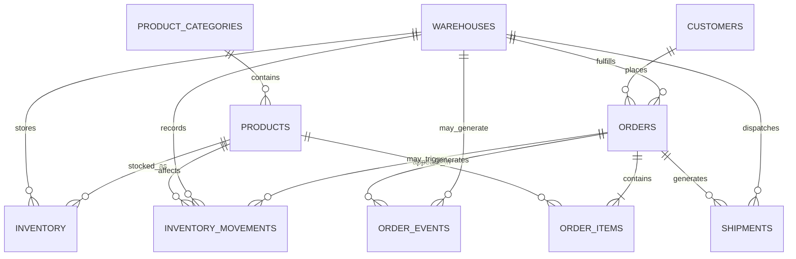

# FulfillAI Data Model

FulfillAI uses a relational operational model for customers, products,
inventory, orders, shipments and fulfillment events.

## Entity Relationship Model

## Core Entities

### Customers

Represents customers placing orders through the commerce platform.

### Products

Contains sellable products and their pricing and category information.

### Warehouses

Represents fulfillment locations responsible for processing orders.

### Inventory

Stores the current product inventory position for each warehouse.

### Orders

Represents customer purchases and their current fulfillment state.

### Order Items

Stores the individual products and quantities contained in an order.

### Shipments

Tracks delivery-related information associated with an order.

### Inventory Movements

Provides an auditable history of inventory changes such as receipts,
reservations, shipments and returns.

### Order Events

Stores operational events generated throughout the order lifecycle.

Examples include:

- order_created
- payment_confirmed
- inventory_reserved
- processing_started
- order_packed
- shipment_created
- order_shipped
- delivery_exception
- order_delivered
- order_cancelled

The event table is designed to support the streaming architecture planned
for later project phases.

## Current Modeling Assumption

FulfillAI v1 assigns an order to one primary fulfillment warehouse.

Multiple shipments are supported for an order, but multi-warehouse
fulfillment of a single order is outside the initial scope.

If future requirements require split fulfillment across warehouses, the
model can be extended with an order-item fulfillment allocation table.