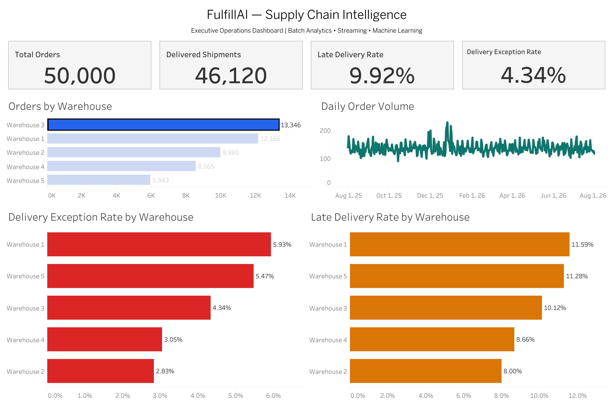

# FulfillAI Tableau Executive Dashboard

## Why I added it

Most of FulfillAI lives in code, SQL, and model artifacts. I wanted one view of the system that answers a simpler question: what is happening operationally across the warehouses?

The result is a Tableau Public dashboard titled **FulfillAI — Supply Chain Intelligence**.

## Live dashboard

https://public.tableau.com/app/profile/chaithanya.vemuri/viz/FullfillAI_Supplychain_Intelligence/FulfillAI-ExecutiveOverview

## Preview



## Data source

The dashboard uses the BI-ready `warehouse_daily.csv` export generated from FulfillAI's analytical layer.

It is an exported-data Tableau Public workflow, not a live PostgreSQL connection. I keep that distinction explicit because the dashboard should describe the system that actually exists.

## KPIs

- **50,000** total orders
- **46,120** delivered shipments
- **9.92%** late-delivery rate
- **4.34%** delivery-exception rate
- **5** warehouses

## Views

- total-order and delivery KPI cards;
- daily order volume;
- orders by warehouse;
- late-delivery rate by warehouse;
- delivery-exception rate by warehouse.

## Cross-filtering

The Orders by Warehouse chart acts as the main filter. Selecting a warehouse updates the KPI cards, daily order trend, late-delivery view, and delivery-exception view.

For example, selecting Warehouse 3 shows:

- Orders: **13,346**
- Delivered shipments: **12,319**
- Late-delivery rate: **10.12%**
- Delivery-exception rate: **4.34%**

## Where it fits

The dashboard sits at the end of the analytical path:

```text
PostgreSQL
   ↓
SQL / dbt analytical layer
   ↓
warehouse_daily.csv
   ↓
Tableau Public
```

It is intentionally small. I preferred a few views that connect directly to the underlying fulfillment model over a larger dashboard filled with metrics that the rest of the project does not use.
